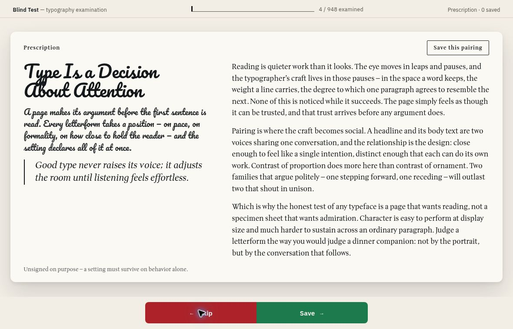
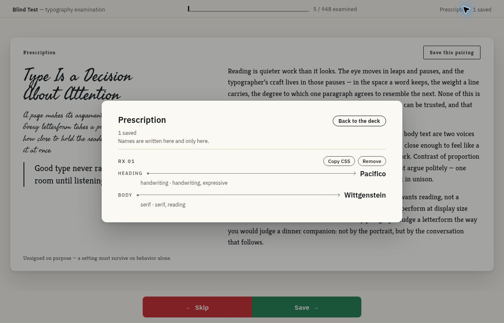

# Blind Test · Typography Matcher

**Pick the typography before you learn the font names.**

Blind Test puts different heading and body fonts into the same sample page, with their names hidden. Skip combinations that do not work for you, save the ones that do, then open **Prescription** to reveal the families and copy the Google Fonts/CSS setup for your own layout.

[Try Blind Test](https://font.graydonwasil.com/) · [How to use it](#judge-save-reveal) · [Use your chosen fonts](#take-a-pairing-into-your-project) · [Run locally](#run-locally)



*Actual app capture. The specimen holds its content and layout constant so the typography is what changes.*

## Judge, save, reveal

| Step | What you do | What happens |
| --- | --- | --- |
| **Begin examination** | Dismiss the first-visit introduction | The pairing deck becomes interactive |
| **Judge** | Read the headline, introduction, body text, quote, and small interface text | Both font identities stay hidden |
| **Skip** | Use the bottom Skip button, left arrow, or left swipe/drag | Move to an unseen pair without saving |
| **Save** | Use the bottom Save button, right arrow, or right swipe/drag | Save this pair and advance; duplicate saves are avoided |
| **Prescription** | Open the saved count in the upper-right corner | Reveal heading/body names, categories, and tags |
| **Copy CSS** | Copy a saved pair’s export | Get a Google Fonts link and CSS custom properties |

The “Save this pairing” button inside the sample webpage is intentionally specimen content. Use the **bottom judgment bar**, keyboard arrows, or swipe gesture to save a real selection.

Prescription keeps saved pairs in judgment order. Remove a pair there if you no longer want it. **Back to the deck**, clicking the scrim, or Escape closes the dialog and restores focus; deck-judgment inputs pause while it is open.

## Take a pairing into your project



*The saved fourth pairing is Pacifico + Wittgenstein. The specimen behind the dialog has already advanced to the next pair.*

**Copy CSS** provides two pieces:

1. A Google Fonts stylesheet link requesting the pairing’s supported faces.
2. A style block defining its font families and weights as custom properties.

It does not export the specimen layout or automatically apply those variables to your page. After inserting the copied link/style block, connect the variables to your own selectors:

```css
body {
  font-family: var(--font-body);
  font-weight: var(--weight-body);
}

h1, h2, h3 {
  font-family: var(--font-heading);
  font-weight: var(--weight-heading);
}

strong {
  font-weight: var(--weight-body-strong);
}
```

The export also includes `--weight-heading-soft`. Family values carry category-appropriate fallbacks. Requested italic faces do not automatically make text italic; apply that styling where your layout needs it.

If clipboard access fails, the app exposes the export in a selected, read-only text area for manual copying.

## A large deck without repeat draws

The current committed deck contains **948 pairings covering 1,804 unique Google Fonts families**: 61 editorial pairings plus 887 generated catalog entries.

| Behavior | Detail |
| --- | --- |
| Random draws | Choose from the unseen pool |
| Look-ahead loading | Preload the next three pairings without marking them seen until drawn |
| Font readiness | Wait for the requested faces to decode before replacing the specimen |
| Failed load | Keep the previous specimen and offer **Try the next lens** after the loading failure; the failed draw counts as seen |
| Refresh | Restore the current pairing without consuming a new draw |
| Deck exhaustion | Stop and offer an explicit reshuffle |
| Reshuffle | Reset progress while retaining saved pairs |

The default font-load timeout is four seconds. Loading depends on the network and Google Fonts, so this is not an offline font library. Upcoming fonts may be ready immediately, but the app still waits when you move faster than the preload buffer.

The catalog generator uses Google Fonts metadata, keeps Latin-text families, excludes symbol/barcode faces, and reserves expressive faces for headings. Pairing selection uses a generated deck; it does not generate new pairings through an AI service while you browse.

## What is saved

The current pairing, seen IDs, saved IDs, and first-visit dismissal live in **localStorage in this browser**. There is no account or cloud synchronization. Clearing site data removes those records.

If browser storage fails, the application continues with session memory and a notice. That session’s new changes will not survive a reload.

The current product intentionally uses one fixed English specimen. It does not offer custom sample text, alternate page templates, font-adjustment sliders, dark mode, or shareable pairing URLs.

## Stack and architecture

| Layer | Technology | Responsibility |
| --- | --- | --- |
| Interface | Vanilla TypeScript and DOM APIs | Deck gestures, controls, dialogs, and state transitions |
| Build | Vite | Bundle the app into static assets |
| Typography | Google Fonts CSS API | Load the actual heading/body faces at runtime |
| Styling | CSS custom properties | Apply selected family and weight values while preserving layout |
| Fixed UI | IBM Plex Sans | Keep navigation and judgment controls independent of each pairing |
| Persistence | localStorage | Save progress and selections on this browser |
| Unit tests | Vitest and jsdom | Validate data, selection state, persistence, and UI logic |
| Browser tests | Playwright with system Chrome | Exercise the production preview and real font-loading journey |

The app is static, with no application backend, accounts, or analytics integration. It does make network requests to Google Fonts for typography.

## Run locally

Use **Node.js 24**, matching the CI environment and supporting the font tools’ native TypeScript execution.

```sh
git clone https://github.com/Arrangedgodly/typography-matcher.git
cd typography-matcher
npm ci
npm run dev
```

No application API key, secret, or environment file is required for normal local development. An internet connection is needed to load the specimen fonts.

| Command | Purpose |
| --- | --- |
| `npm run dev` | Start the local development server |
| `npm run build` | Type-check and produce the static build |
| `npm run preview` | Preview the production build |
| `npm test` | Run unit tests |
| `npm run test:e2e` | Run the local browser gate against system Chrome and live Google Fonts |
| `npm run validate:fonts` | Validate requested family, weight, and style responses; sample font cache policies |
| `npm run expand:fonts` | Regenerate catalog entries while retaining editorial pairings |

## Catalog maintenance and verification

Pairings live in [src/data/pairings.json](src/data/pairings.json), with shape validation when the app loads and during `npm run validate:fonts`. The catalog rules and regeneration process are documented in [docs/FONT_CATALOG.md](docs/FONT_CATALOG.md).

Font validation checks the requested CSS responses and samples up to 100 WOFF2 cache-policy responses. The local end-to-end journey uses real Google Fonts, but it does not visit every one of the 948 pairings: its terminal-state test seeds progress. Full-deck exhaustion behavior is covered by unit tests.

The GitHub Actions deployment workflow runs font validation, unit tests, and the production build before GitHub Pages deployment. Playwright remains a separate local gate. These are distinct kinds of coverage; a successful deployment is not a claim that every pairing was manually viewed in every browser.

Keyboard arrows are first-class judgment controls, and reduced-motion preferences disable the card animation. The fixed interface colors do not change with the selected fonts.

## Deployment and documentation

The repository deploys to GitHub Pages through GitHub Actions, with its custom-domain DNS setup documented through Cloudflare.

- [PRODUCT.md](PRODUCT.md): purpose and product principles
- [DESIGN.md](DESIGN.md): visual and interaction decisions
- [Font catalog](docs/FONT_CATALOG.md): coverage and generation rules
- [Deployment guide](docs/DEPLOY.md): hosting and custom domain
- [Credits](docs/CREDITS.md): project acknowledgments
